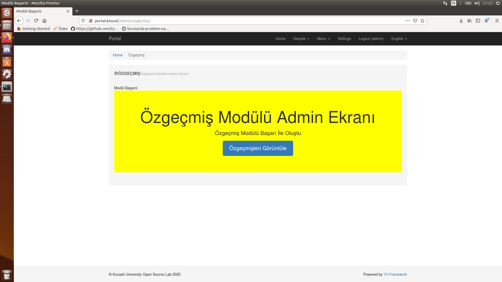
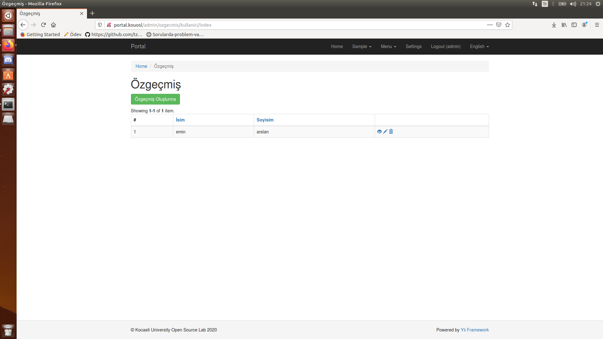
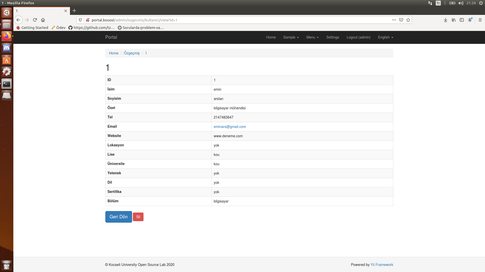
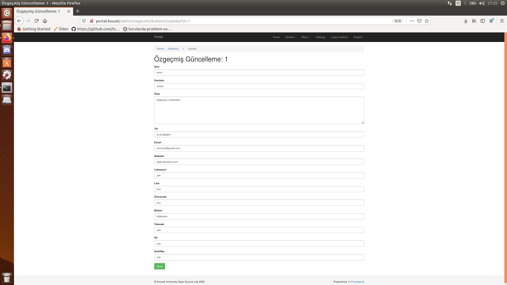
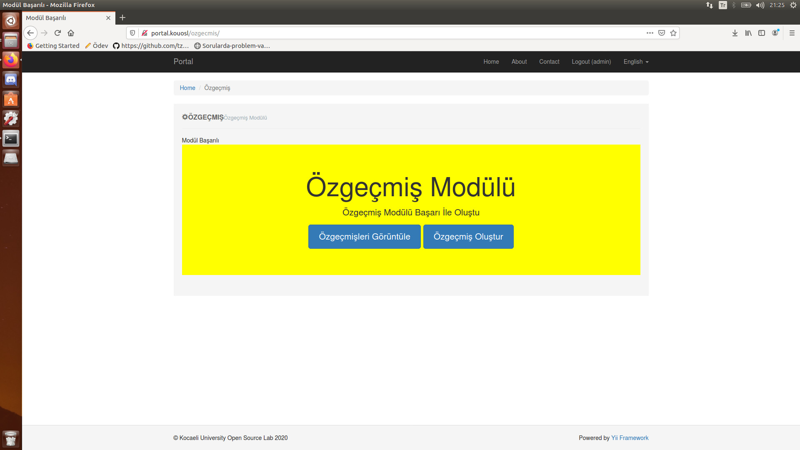

## portal-ozgecmis
Portal projesi için reklam(banner) modülü yapmayı planlıyordum geliştirirken başkası tarafından yapıldığını görünce ozgecmis modülünü geliştirdim.Ozgecmis modülü kullanıcının özgeçmiş olusturup kaydetmesini ve sonrasında düzenlemesini sağlayan bir modül
<br>
<br>

# Kurulum
>Modülü kullanmak için öncelikle  portal klasörünün altındaki composer.json klasörüne:
```
{
    "type": "vcs",
    "url": "https://github.com/2019-BLM317/portal-150201127.git"
}
```
>......
```
"kouosl/portal-ozgecmis": "dev-master" 
```
 >satırlarını eklemeniz gerekmektedir.
>Bunlar eklendikten sonra portal/backend/config altında main.php dosyasına:
```
'ozgecmis' => [
               'class' => 'kouosl\ozgecmis\Module'   // here is our v1 modules
            ]
 ```
>  eklenmelidir.
>     Bunu da ekledikten sonra portal/frontend/config altında main.php dosyasına:
```
'ozgecmis' => [
                'class' => 'kouosl\ozgecmis\Module'   // here is our v1 modules
            ]
```
> .... eklenmelidir. simdi modül kullanılmaya hazır.
>terminalden vagrant-portal'a gidip vagrant up yapmanız gerekiyor
> ardından vagrant ssh ile sanal makinaya girmemiz lazım.
>sanal makinada var/www/portal dizininde composer update yaptıktan sonra sadece migrationsu işlemek kalıyor.
> ## Migrations <br>
>Migrationsu işlemek için su yetkisiyle sanal makinede aşağıdaki kod çalıştırılmalıdır
```
php yii migrate --migrationPath=@vendor/kouosl/portal-ozgecmis/migrations --interactive=0
```
<br> 
# Erişim 
> Modül Sayfası(admin) : http://portal.kouosl/admin/ozgecmis 
> Modül Sayfası : http://portal.kouosl/ozgecmis 

## Panel Görünümleri

 - Admin Paneli -> [http://portal.kouosl/admin/ozgecmis/](http://portal.kouosl/admin/ozgecmis/)





- Kullanıcı Paneli -> [http://portal.kouosl/ozgecmis/](http://portal.kouosl/ozgecmis/)



